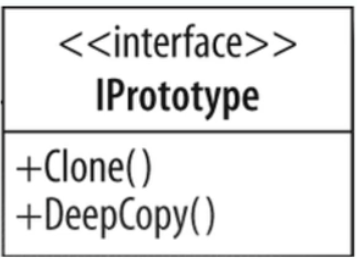

**Prototype**

_Specify the kinds of objects to create using a prototypical instance, and create new objects from the 'skeleton' of an
existing object, thus boosting performance and keeping memory footprints to a minimum._

UML Diagram:

