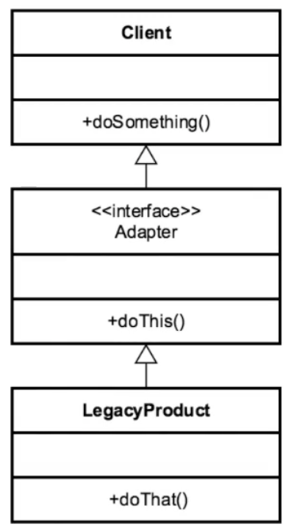

**Definition:**

_Convert the interface of a class into another interface clients expect. An adapter lets classes work together that could not otherwise because of incompatible interfaces._

UML Diagram:

