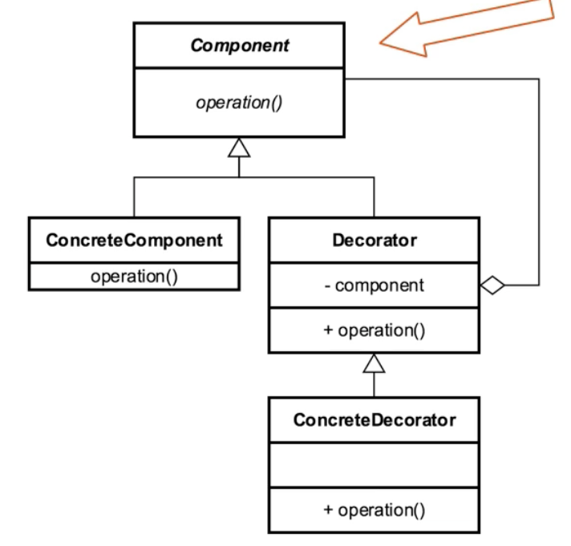

**Definition:**

_Attach additional responsibilities to an object dynamically keeping the same interface. Decorators provide a flexible
alternative to subclassing for extending functionality._

UML Diagram:

